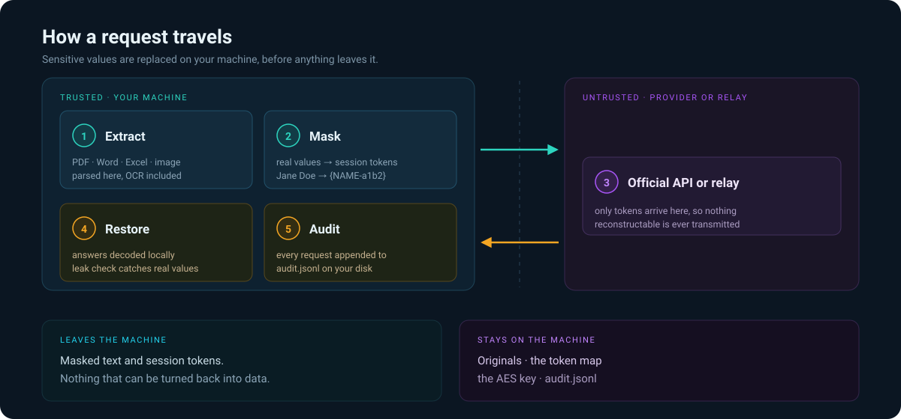

<p align="center"><a id="top"></a><b>🌐</b> English · <a href="docs/i18n/README.zh-CN.md">Chinese</a></p>

<p align="center"></p>

<h1 align="center">🛡️ LLM Privacy Gateway</h1>

<p align="center"><b>Real sensitive data never leaves your machine — even with third-party APIs or untrusted relays.</b></p>

<p align="center">
  <a href="#-how-it-works"></a>
  <a href="#-install"></a>
  <a href="#-install"></a>
  <a href="#-security-model"></a>
  <a href="#-how-it-works"></a>
  <a href="LICENSE"></a>
</p>

<p align="center">
  <a href="#-how-it-works">How it works</a> &nbsp;·&nbsp;
  <a href="#-features">Features</a> &nbsp;·&nbsp;
  <a href="#-install">Install</a> &nbsp;·&nbsp;
  <a href="#-quick-start">Quick start</a> &nbsp;·&nbsp;
  <a href="#-security-model">Security</a> &nbsp;·&nbsp;
  <a href="#-support">Support</a> &nbsp;·&nbsp;
  <a href="#-license">License</a>
</p>

---

## 🔍 How it works

A cross-agent skill: sensitive fields are tokenized locally, files and images are parsed locally (bodies never upload), and only masked text reaches official APIs or relays. Responses are restored and leak-checked locally, and every request is audited.

No framework, no backend, no daemon — plain Python scripts running on your own CPU.

<p align="center"></p>

## ✨ Features

| Module | Script | What it does |
| :--- | :--- | :--- |
| 🔍 **Masking** | `scripts/masker.py` | ID / mobile / landline / email / bank card / IP / amount + custom dictionary → session-random tokens |
| 📄 **Local extraction** | `scripts/local_extract.py` | Text from PDF / Word / Excel / images (OCR) locally — bodies never upload |
| 🔐 **Encrypted storage** | `scripts/crypto_store.py` | AES-256-GCM for core secrets; the key stays local |
| 🚦 **Privacy gateway** | `scripts/gateway.py` | Extract → mask → send → restore + leak check → audit |
| 📦 **Dependencies** | `scripts/setup_deps.py` | One-click dependency check and install |

## 🚀 Quick start

```bash
# Dry-run (no send): preview exactly what would leave your machine
python scripts/gateway.py --text "Invoice for Acme Corp: card 4111111111111111, total 5,000 USD" --dry-run

# Send through a relay (API key from an env var: $env:RELAY_API_KEY=... / export RELAY_API_KEY=...)
set RELAY_API_KEY=sk-xxx
python scripts/gateway.py --text "Summarise this quote: Jane Doe, quoted 12,000 USD" --endpoint relay

# File (text extracted locally, the body never leaves)
python scripts/gateway.py --file ./contracts/quote.pdf --endpoint relay

# Strict mode: enterprise-dictionary hits are refused outbound
python scripts/gateway.py --file ./confidential/roadmap.docx --endpoint relay --strict
```

## 🔐 Security model

- Every endpoint — relays included — is treated as **untrusted**. Only masked text goes out; leaked real values are blocked (exit 3); `--strict` refuses enterprise-dictionary hits (exit 4); every request is appended to `~/.llm-privacy-gate/audit.jsonl`.
- **Zero local compute**: masking, extraction and encryption run on your CPU, so no GPU is needed. Inference stays with the cloud provider or relay you already use.
- **Session-random tokens** such as `{PHONE-xxxx-N}` prevent cross-session correlation; core secrets are encrypted by default.

## 📦 Install

This is a standard Agent skill folder (`SKILL.md` + `scripts/` + `references/`). Copy it into the skills directory of any compatible tool — the UI is provided by that platform's agent.

| Tool | Location |
| :--- | :--- |
| Doubao Work | `workspace/.user_skills/` |
| OpenAI Codex | `~/.codex/skills/` or `.codex/skills/` |
| DeepSeek Harness | `.dsh/skills/` |
| OpenClaw | `~/.openclaw/skills/` |
| WorkBuddy | `.codebuddy/skills/` |
| Claude and other Agent Skills tools | their own skills directory convention |

Then run once per environment:

```bash
python scripts/setup_deps.py
```

## ⚙️ Config

Copy `references/config.example.json` to `~/.llm-privacy-gate/config.json`. Resolution order: `--config` → `LPG_CONFIG` → `~/.llm-privacy-gate/config.json` → the built-in example. API keys are read from environment variables only.

## ⚠️ Limitations

Read `references/rules.md` for the full rule set and their exact patterns.

- Masking protects only content that matches a rule — everything else still leaves.
- "The model fully understands it, yet the provider cannot decrypt it" is cryptographically impossible. What this gateway actually delivers: the real data cannot be obtained, and anything stolen cannot be reconstructed.
- For high-risk content (core secrets), use `--local` or the encrypted store — keep it off the wire entirely.

## ☕ Support

Spare-time project, no company behind it, no ads, no telemetry, no paid tier. Every feature stays free for everyone — that does not change whether you tip or not.

So this is not a paywall, it is a tip jar. But count up what it has already given you: the afternoon you did not spend redacting a contract by hand, the client file you could hand to an API without hesitating first. If it saved you even one of those, sending a little back is the most direct way to keep the next one saved too. A tip turns into hours spent on this project, and those hours have no other source.

- ⭐ **Star the repository** — free, and it is what actually gets the project in front of people
- 🐛 **Report a bug** — honestly worth more than a tip
- 📣 **Send it to one person who needs it** — costs nothing, reaches exactly the right person
- ☕ **Send a tip** — the most direct way to buy the project more time

<p align="center">
  <a href="docs/SUPPORT.md"><b>☕ Support options · payment codes inside</b></a>
</p>

## 📄 License

Released under the [MIT License](LICENSE) — use it, fork it, embed it in commercial products. All that is asked in return is that the copyright notice travels with the code.

## 🌐 Translations

| Language | README | Skill | Rules | Support |
| :--- | :--- | :--- | :--- | :--- |
| English | this file | `SKILL.md` | `references/rules.md` | `docs/SUPPORT.md` |
| Simplified Chinese | [README](docs/i18n/README.zh-CN.md) | [Skill](docs/i18n/SKILL.zh-CN.md) | [Rules](docs/i18n/RULES.zh-CN.md) | [Support](docs/i18n/SUPPORT.zh-CN.md) |

---

<p align="center"><sub><a href="#top">Back to top</a></sub></p>
